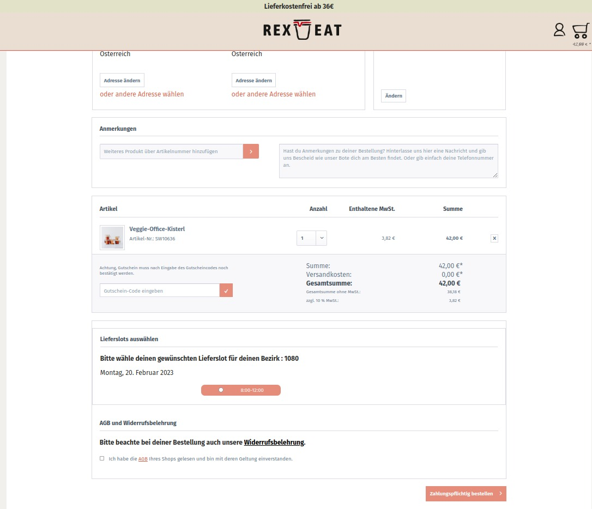
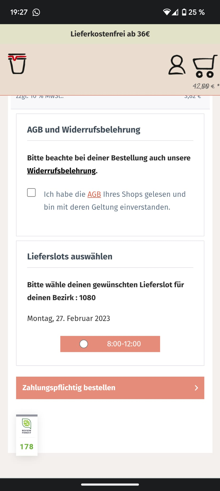

# Nackad Shopware Plugin

## Overview

The **Nackad Shopware Plugin** seamlessly integrates with the Shopware store, enhancing the shopping experience by providing users with a streamlined way to select delivery slots based on their location. This plugin fetches available delivery slots from the nackad-zerowaste backend and displays them in a user-friendly, Shopware-styled interface.

## Key Features

- **Zip Code Based Shop Selection**: Users are prompted to select a delivery slot based on their zip code, ensuring that the delivery options are tailored to their specific location.
- **Shopware Styled Interface**: Delivery slots are presented in a manner consistent with Shopware's design language, offering a cohesive and intuitive user experience.
- **Backend Integration**: After the user completes their purchase, the selected shop information is sent to the `nackad-zerowaste` backend for processing.

## Screenshots

1.  
2.  
